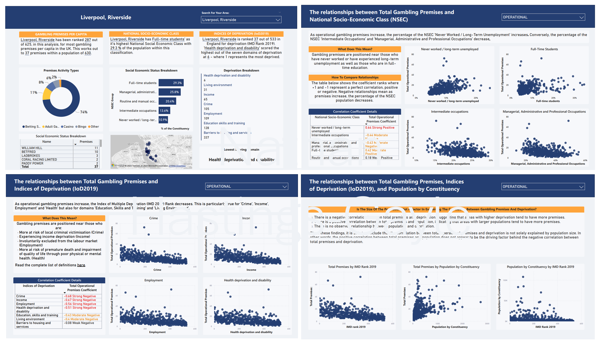

Welcome to my personal data analytics hub! This site serves as a showcase for the analytics projects that fuel my passion for unravelling insights from diverse datasets. Exploring new data and extracting meaningful patterns is not just a professional pursuit for me; it's a rewarding journey. Join me as I navigate through data and tell unique stories, discovering hidden gems in the vast landscape of information available online.

Projects 
------
### What Is The Link Between Gambling Premises, Deprivation and National Socio-Economic Class?

This project explores the correlations between gambling premises, deprivation and national socio-economic class. It aims to instigate conversations in local communities and assist in discussions with local councils around accepting new applications for gambling premises or addressing the presence of exisitng premises.

](https://nathanhgayle.github.io/portfolio/)